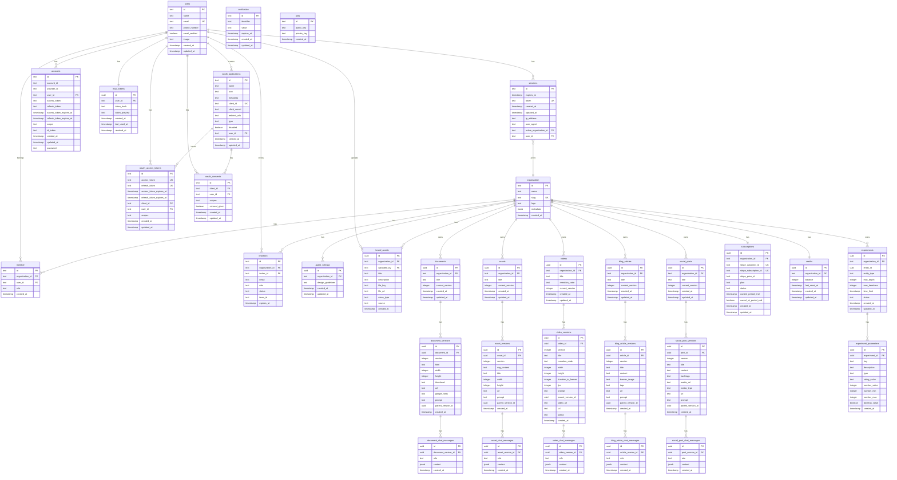

# Guidenco Database Schema

```mermaid
erDiagram
    %% AUTH
    users {
        text id PK
        text name
        text email UK
        text phone_number
        boolean email_verified
        text image
        timestamp created_at
        timestamp updated_at
    }

    sessions {
        text id PK
        timestamp expires_at
        text token UK
        timestamp created_at
        timestamp updated_at
        text ip_address
        text user_agent
        text active_organization_id FK
        text user_id FK
    }

    accounts {
        text id PK
        text account_id
        text provider_id
        text user_id FK
        text access_token
        text refresh_token
        timestamp access_token_expires_at
        timestamp refresh_token_expires_at
        text scope
        text id_token
        timestamp created_at
        timestamp updated_at
        text password
    }

    verification {
        text id PK
        text identifier
        text value
        timestamp expires_at
        timestamp created_at
        timestamp updated_at
    }

    jwks {
        text id PK
        text public_key
        text private_key
        timestamp created_at
    }

    %% ORGS
    organization {
        text id PK
        text name
        text slug UK
        text logo
        jsonb metadata
        timestamp created_at
    }

    member {
        text id PK
        text organization_id FK
        text user_id FK
        text role
        timestamp created_at
    }

    invitation {
        text id PK
        text organization_id FK
        text inviter_id FK
        text email
        text role
        text status
        text team_id
        timestamp expires_at
    }

    %% AGENT & BRAND
    agent_settings {
        uuid id PK
        text organization_id FK
        text design_guidelines
        timestamp created_at
        timestamp updated_at
    }

    brand_assets {
        uuid id PK
        text organization_id FK
        text uploaded_by FK
        text title
        text description
        text file_key
        text file_url
        text mime_type
        text source
        timestamp created_at
    }

    %% DOCUMENTS
    documents {
        uuid id PK
        text organization_id FK
        text title
        integer current_version
        timestamp created_at
        timestamp updated_at
    }

    document_versions {
        uuid id PK
        uuid document_id FK
        integer version
        text html
        integer width
        integer height
        text thumbnail
        text url
        text google_fonts
        text prompt
        uuid parent_version_id
        timestamp created_at
    }

    document_chat_messages {
        uuid id PK
        uuid document_version_id FK
        text role
        jsonb content
        timestamp created_at
    }

    %% ASSETS
    assets {
        uuid id PK
        text organization_id FK
        text title
        integer current_version
        timestamp created_at
        timestamp updated_at
    }

    asset_versions {
        uuid id PK
        uuid asset_id FK
        integer version
        text svg_content
        text title
        integer width
        integer height
        text url
        text prompt
        uuid parent_version_id
        timestamp created_at
    }

    asset_chat_messages {
        uuid id PK
        uuid asset_version_id FK
        text role
        jsonb content
        timestamp created_at
    }

    %% VIDEOS
    videos {
        uuid id PK
        text organization_id FK
        text title
        text remotion_code
        integer current_version
        timestamp created_at
        timestamp updated_at
    }

    video_versions {
        uuid id PK
        uuid video_id FK
        integer version
        text title
        text remotion_code
        integer width
        integer height
        integer duration_in_frames
        integer fps
        text prompt
        uuid parent_version_id
        text video_url
        text url
        text status
        timestamp created_at
    }

    video_chat_messages {
        uuid id PK
        uuid video_version_id FK
        text role
        jsonb content
        timestamp created_at
    }

    %% BLOG
    blog_articles {
        uuid id PK
        text organization_id FK
        text title
        integer current_version
        timestamp created_at
        timestamp updated_at
    }

    blog_article_versions {
        uuid id PK
        uuid article_id FK
        integer version
        text title
        text content
        text banner_image
        text tags
        text url
        text prompt
        uuid parent_version_id
        timestamp created_at
    }

    blog_article_chat_messages {
        uuid id PK
        uuid article_version_id FK
        text role
        jsonb content
        timestamp created_at
    }

    %% SOCIAL
    social_posts {
        uuid id PK
        text organization_id FK
        text title
        integer current_version
        timestamp created_at
        timestamp updated_at
    }

    social_post_versions {
        uuid id PK
        uuid post_id FK
        integer version
        text title
        text content
        text hashtags
        text media_url
        text media_type
        text url
        text prompt
        uuid parent_version_id
        timestamp created_at
    }

    social_post_chat_messages {
        uuid id PK
        uuid post_version_id FK
        text role
        jsonb content
        timestamp created_at
    }

    %% BILLING
    subscriptions {
        uuid id PK
        text organization_id FK
        text stripe_customer_id UK
        text stripe_subscription_id UK
        text stripe_price_id
        text plan
        text status
        timestamp current_period_end
        boolean cancel_at_period_end
        timestamp created_at
        timestamp updated_at
    }

    credits {
        uuid id PK
        text organization_id FK
        integer balance
        timestamp last_reset_at
        timestamp created_at
        timestamp updated_at
    }

    %% MCP / OAUTH
    mcp_tokens {
        uuid id PK
        text user_id FK
        text token_hash
        text token_preview
        timestamp created_at
        timestamp last_used_at
        timestamp revoked_at
    }

    oauth_applications {
        text id PK
        text name
        text icon
        text metadata
        text client_id UK
        text client_secret
        text redirect_urls
        text type
        boolean disabled
        text user_id FK
        timestamp created_at
        timestamp updated_at
    }

    oauth_access_tokens {
        text id PK
        text access_token UK
        text refresh_token UK
        timestamp access_token_expires_at
        timestamp refresh_token_expires_at
        text client_id FK
        text user_id FK
        text scopes
        timestamp created_at
        timestamp updated_at
    }

    oauth_consents {
        text id PK
        text client_id FK
        text user_id FK
        text scopes
        boolean consent_given
        timestamp created_at
        timestamp updated_at
    }

    %% EXPERIMENTS
    experiments {
        uuid id PK
        text organization_id FK
        uuid entity_id
        text entity_type
        integer max_depth
        integer max_iterations
        timestamp time_limit
        text status
        timestamp created_at
        timestamp updated_at
    }

    experiment_parameters {
        uuid id PK
        uuid experiment_id FK
        text key
        text description
        text type
        text string_value
        integer number_value
        integer number_min
        integer number_max
        boolean boolean_value
        timestamp created_at
    }

    %% RELATIONSHIPS
    users ||--o{ sessions : has
    users ||--o{ accounts : has
    sessions }o--|| organization : active

    organization ||--o{ member : has
    organization ||--o{ invitation : has
    users ||--o{ member : belongs
    users ||--o{ invitation : invites
    organization ||--o{ agent_settings : has
    organization ||--o{ brand_assets : has
    users ||--o{ brand_assets : uploads

    organization ||--o{ documents : owns
    documents ||--o{ document_versions : has
    document_versions ||--o{ document_chat_messages : has

    organization ||--o{ assets : owns
    assets ||--o{ asset_versions : has
    asset_versions ||--o{ asset_chat_messages : has

    organization ||--o{ videos : owns
    videos ||--o{ video_versions : has
    video_versions ||--o{ video_chat_messages : has

    organization ||--o{ blog_articles : owns
    blog_articles ||--o{ blog_article_versions : has
    blog_article_versions ||--o{ blog_article_chat_messages : has

    organization ||--o{ social_posts : owns
    social_posts ||--o{ social_post_versions : has
    social_post_versions ||--o{ social_post_chat_messages : has

    organization ||--|| subscriptions : has
    organization ||--|| credits : has

    users ||--|| mcp_tokens : has
    users ||--o{ oauth_applications : creates
    oauth_applications ||--o{ oauth_access_tokens : issues
    oauth_applications ||--o{ oauth_consents : has
    users ||--o{ oauth_access_tokens : has
    users ||--o{ oauth_consents : has

    organization ||--o{ experiments : owns
    experiments ||--o{ experiment_parameters : has
```
